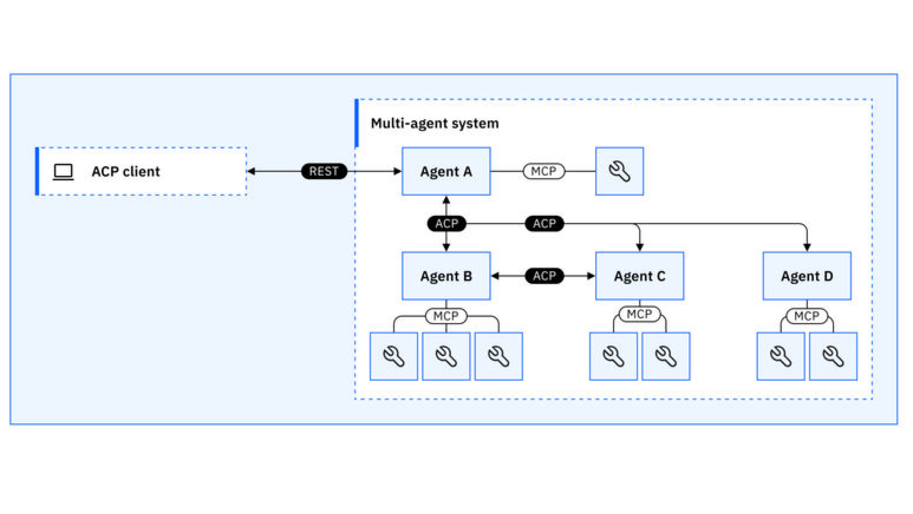
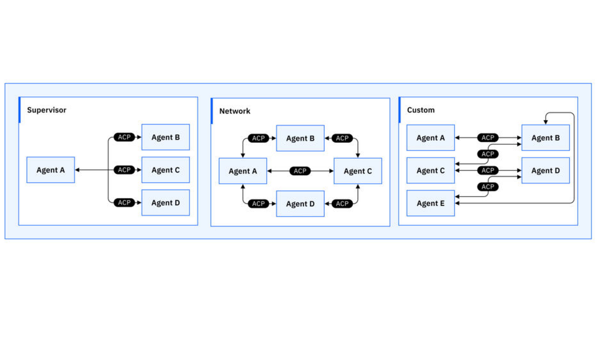
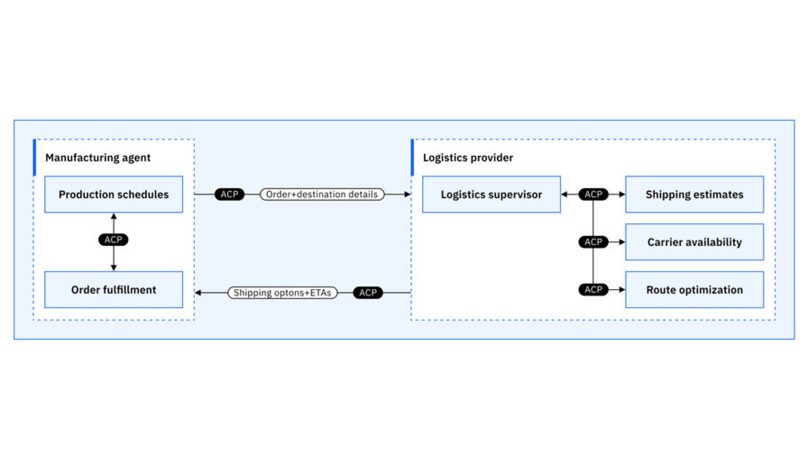

# Что такое Agent Communication Protocol (ACP)?

**Авторы**

Сэнди Бесен<br />Инженер-исследователь в области AI и руководитель экосистемы<br />IBM

Анна Гутовска<br />Инженер в области AI, Developer Advocate<br />IBM

[Оригинал](https://www.ibm.com/think/topics/agent-communication-protocol)

**Протокол Общения Агентов** (Agent Communication Protocol, **ACP**) — это открытый стандарт для общения между агентами (agent-to-agent, A2A). С помощью этого протокола мы можем преобразовать наш текущий ландшафт изолированных агентов в **функционально совместимые** агентные системы с более простой интеграцией и **сотрудничеством**.

## Обзор

С помощью [ACP](https://towardsdatascience.com/tag/acp/), первоначально представленного проектом [BeeAI от IBM](https://beeai.dev/), [AI-агенты](https://www.ibm.com/think/topics/ai-agents) могут свободно взаимодействовать между командами, фреймворками, технологиями и организациями. Это универсальный протокол, который превращает сегодняшний фрагментированный ландшафт AI-агентов во взаимосвязанных членов команды. Этот открытый стандарт открывает новые уровни совместимости, повторного использования и масштабируемости. Являясь следующим шагом после Протокола Контекста Модели (Model Context Protocol, MCP), открытого стандарта для доступа к инструментам и данным, ACP определяет, как агенты работают и общаются.¹

Для контекста: AI-агент — это система или программа, способная автономно выполнять задачи от имени пользователя или другой системы. Он выполняет их, проектируя свой воркфлоу и используя доступные инструменты. [Мультиагентные системы](https://www.ibm.com/think/topics/multiagent-system) состоят из множества AI-агентов, работающих совместно для выполнения задач от имени пользователя или другой системы.

Как стандарт общения AI-агентов с открытым управлением, ACP позволяет агентам искусственного интеллекта (AI) общаться между различными фреймворками и технологическими стеками. От приёма запросов пользователя на естественном языке до выполнения серии действий, AI-агенты работают лучше, когда им предоставлены протоколы общения. Эти протоколы передают информацию между инструментами, другими агентами и, в конечном счёте, пользователю.

[Общение AI-агентов](https://www.ibm.com/think/topics/ai-agent-communication) — это то, как агенты [AI](https://www.ibm.com/think/topics/artificial-intelligence) взаимодействуют друг с другом, с людьми или с внешними системами для обмена информацией, принятия решений и выполнения задач. Это общение особенно важно в мультиагентных системах, где несколько AI-агентов ведут совместную работу, и во взаимодействии человека и AI.

ACP является частью растущей экосистемы, включающей BeeAI. Ниже приведены некоторые ключевые особенности, а более подробно об основных концепциях и деталях вы можете прочитать в [официальной документации](https://agentcommunicationprotocol.dev/introduction/welcome).



*Пример взаимодействия клиента ACP и агентов ACP из разных фреймворков.*

## Ключевые особенности ACP

* **Общение на основе REST:** ACP использует стандартные соглашения HTTP для обмена данными, что упрощает его интеграцию в рабочую среду. В то время как MCP полагается на формат JSON-RPC, который требует гораздо более сложных методов обмена данными.
* **Не требует SDK:** ACP не требует никаких специализированных библиотек. Вы можете взаимодействовать с интеллектуальными агентами с помощью таких инструментов, как cURL, Postman или даже ваш браузер. Для дополнительного удобства доступен соответствующий SDK.
* **Обнаружение в офлайн-режиме:** Агенты ACP могут встраивать метаданные напрямую в свои дистрибутивные пакеты, что позволяет обнаруживать их, даже когда они неактивны. Это обеспечивает поддержку сред с масштабированием до нуля (scale-to-zero), где ресурсы распределяются динамически и могут быть не всегда доступны в сети.
* **Приоритет асинхронного режима с поддержкой синхронного:** ACP спроектирован так, что по умолчанию используется асинхронное общение. Этот метод идеально подходит для длительных или сложных задач. Синхронные запросы также поддерживаются.

**Примечание:** ACP обеспечивает оркестрацию агентов для любой агентной архитектуры, но не управляет воркфлоу, развёртываниями или координацией между агентами. Вместо этого он делает возможной оркестрацию разнородных агентов путем стандартизации способов их общения. Подразделение IBM Research создало BeeAI — систему с открытым исходным кодом, предназначенную для оркестрации, развёртывания и совместного использования агентов и использующую ACP в качестве коммуникационного слоя.

## Зачем нам нужен ACP



*Различные архитектуры агентов, реализованные с помощью ACP.*

По мере роста популярности [агентных систем AI](https://www.ibm.com/think/topics/agentic-ai) растёт и сложность в понимании того, как получить наилучший результат от каждой отдельной технологии для [вашего варианта использования](https://www.ibm.com/think/topics/ai-agent-use-cases), не будучи привязанным к конкретному поставщику (вендору). Каждый [фреймворк](https://www.ibm.com/think/insights/top-ai-agent-frameworks), платформа и инструментарий (toolkit) предлагают уникальные преимущества, но их интеграция в единую агентную систему является сложной задачей.

Сегодня большинство агентных систем работают изолированно. Они построены на несовместимых фреймворках, предоставляют специализированные API и конечные точки (endpoints) и не имеют общего протокола для общения. Их соединение требует хрупких и неповторяемых интеграций, создание которых обходится дорого.

ACP представляет собой фундаментальный сдвиг: от фрагментированной, построенной по ситуации (ad hoc) экосистемы к взаимосвязанной сети агентов, где каждый способен обнаруживать, понимать и сотрудничать с другими, независимо от того, кто их создал или на каком стеке они работают. С помощью ACP разработчики могут использовать коллективный интеллект разнородных агентов для создания более мощных воркфлоу, чем те, что может реализовать одна система в одиночку.

## Текущие проблемы

Несмотря на быстрый рост возможностей агентов, их интеграция в реальных условиях остаётся главным препятствием. Без общего протокола общения организации сталкиваются с несколькими повторяющимися проблемами:

* **Разнообразие фреймворков:** Организации обычно используют сотни или тысячи агентов, созданных с помощью различных фреймворков, таких как [LangChain](https://www.ibm.com/think/topics/langchain), [crewAI](https://www.ibm.com/think/topics/crew-ai), AutoGen, или на основе собственных стеков.
* **Специализированная интеграция:** Без стандартного протокола разработчикам приходится писать специализированные коннекторы для каждого взаимодействия между агентами.
* **Экспоненциальный рост сложности:** При наличии $n$ агентов вам потенциально потребуется $n(n-1)/2$ различных точек интеграции, что затрудняет поддержку крупномасштабных экосистем агентов.
* **Межорганизационные аспекты:** Различные модели безопасности, системы аутентификации и форматы данных усложняют интеграцию между компаниями.

## Пример из реальной жизни

Чтобы проиллюстрировать реальную потребность в [общении между агентами](https://www.ibm.com/think/topics/ai-agent-communication), рассмотрим две организации:

* **Производственная компания**, которая использует автономного агента для управления производственными графиками и выполнением заказов на основе внутренних складских запасов и потребительского спроса.
* **Логистическая компания**, которая использует агента для предоставления оценок стоимости доставки в реальном времени, информации о доступности перевозчиков и оптимизации маршрутов.



*Пример использования двух агентов (производственного и логистического), работающих с ACP и общающихся друг с другом между организациями.*

Теперь представьте, что системе производителя необходимо оценить сроки доставки для крупного индивидуального заказа оборудования, чтобы сформировать коммерческое предложение для клиента.

**Без ACP:** Этот подход требует создания индивидуальной интеграции между программным обеспечением для планирования производителя и [API логистического провайдера](https://www.ibm.com/think/topics/api). Это означает ручную обработку аутентификации, несоответствий форматов данных и доступности сервиса. Такие интеграции дороги, хрупки и плохо масштабируются по мере присоединения новых партнёров.

**С ACP:** Каждая организация «оборачивает» своего агента в интерфейс ACP. Производственный агент отправляет детали заказа и пункт назначения логистическому агенту, который в ответ предоставляет варианты доставки в реальном времени и предполагаемое время прибытия (ETA). Обе системы осуществляют агентное сотрудничество, не раскрывая свои внутренние механизмы и не требуя написания специализированных интеграций. Новых логистических партнёров можно подключать, просто реализовав с их стороны ACP. Автоматизация, которую обеспечивают AI-агенты в паре с ACP, даёт возможность для масштабирования и оптимизации обмена данными.

# Как начать работу

Простота — это ключевой принцип проектирования ACP. «Обернуть» агент в ACP можно всего в несколько строк кода. Используя Python [SDK](https://www.ibm.com/think/topics/api-vs-sdk), вы можете определить ACP-совместимого агента, просто применив декоратор к функции.

Эта минимальная реализация:
* Создаёт экземпляр сервера ACP.
* Определяет функцию агента с помощью декоратора `@server.agent()`.
* Реализует агента с использованием фреймворка LangChain, с бэкендом на базе [большой языковой модели (LLM)](https://www.ibm.com/think/topics/large-language-models) и памятью для сохранения контекста.
* Преобразует формат сообщений ACP в нативный формат фреймворка, чтобы вернуть структурированный ответ.
* Запускает сервер, делая агента доступным по HTTP.

*Пример кода*:
```python
from typing import Annotated
import os
from typing_extensions import TypedDict
from dotenv import load_dotenv
#ACP SDK
from acp_sdk.models import Message
from acp_sdk.models.models import MessagePart
from acp_sdk.server import RunYield, RunYieldResume, Server
from collections.abc import AsyncGenerator
#Langchain SDK
from langgraph.graph.message import add_messages
from langchain_anthropic import ChatAnthropic 

load_dotenv() 

class State(TypedDict):
    messages: Annotated[list, add_messages]

#Set up the AI model of your choice
llm = ChatAnthropic(model="claude-3-5-sonnet-latest", 
api_key=os.environ.get("ANTHROPIC_API_KEY")) 

#------ACP Requirement-------#
#START SERVER
server = Server()
#WRAP AGENT IN DECORACTOR
@server.agent()
async def chatbot(messages: list[Message])-> AsyncGenerator[RunYield, RunYieldResume]:
    "A simple chatbot enabled with memory"
    #formats ACP Message format to be compatible with what langchain expects
    query = " ".join(
        part.content
        for m in messages
        for part in m.parts             
    )
    #invokes llm
    llm_response = llm.invoke(query)    
    #formats langchain response to ACP compatible output
    assistant_message = Message(parts=[MessagePart(content=llm_response.content)])
    # Yield so add_messages merges it into state
    yield {"messages": [assistant_message]}  

server.run()
#---------------------------#
```

Теперь вы создали полностью ACP-совместимого агента, который может:

* Обнаруживаться другими агентами (в онлайн- или офлайн-режиме).
* Обрабатывать запросы синхронно или асинхронно.
* Общаться, используя стандартные форматы сообщений.
* Интегрироваться с любой другой ACP-совместимой системой.

## Сравнение ACP с MCP и A2A

Чтобы лучше понять роль ACP в развивающейся экосистеме AI, полезно сравнить его с другими новыми протоколами. *Эти протоколы не обязательно являются конкурентами*. Вместо этого они нацелены на разные уровни стека интеграции AI-систем и часто дополняют друг друга.

**Краткий обзор:**

* **[Model Context Protocol (MCP)](https://www.ibm.com/think/topics/model-context-protocol):** Предназначен для обогащения контекста одной модели инструментами, памятью и ресурсами. Представлен компанией Anthropic.
    * **Фокус:** одна модель, много инструментов.

* **Agent Communication Protocol (ACP):** Предназначен для общения между независимыми агентами в разных системах и организациях. Представлен проектом BeeAI от IBM.
    * **Фокус:** множество агентов, безопасная одноранговая работа, отсутствие привязки к поставщику, открытое управление.

* **Agent2Agent Protocol (A2A):** Предназначен для общения между независимыми агентами в разных системах и организациях. Представлен компанией Google.
    * **Фокус:** множество агентов, одноранговая работа, оптимизация под экосистему Google.

## ACP и MCP

Команда ACP изначально рассматривала возможность адаптации Протокола Контекста Модели (MCP), поскольку он предлагает прочную основу для взаимодействий модели с контекстом. Однако они быстро столкнулись с архитектурными ограничениями, которые делали его неподходящим для полноценного общения между агентами.

Почему MCP не подходит для мультиагентных систем:

* **Потоковая передача (Streaming):** MCP поддерживает базовую потоковую передачу (вероятно, полных сообщений), но не более гранулярный «дельта»-стиль, при котором обновления отправляются по мере их появления. «Дельта»-потоки, такие как токены и обновления траектории, — это потоки, состоящие из инкрементальных обновлений, а не из полных пакетов данных. Это ограничение связано с тем, что при создании MCP он не предназначался для взаимодействий в агентном стиле.
* **Общий доступ к памяти:** MCP не поддерживает запуск нескольких агентов на разных серверах с сохранением общего доступа к памяти. ACP также пока не полностью поддерживает эту функцию, но это направление находится в активной разработке.
* **Структура сообщений:** MCP принимает любую схему JSON, но не определяет структуру тела сообщения. Такая гибкость затрудняет функциональную совместимость, особенно при создании агентов, которые должны интерпретировать разнообразные форматы сообщений.
* **Сложность протокола:** MCP использует JSON-RPC и требует специальных SDK и сред выполнения (runtimes). В то время как архитектура ACP на основе REST со встроенной поддержкой асинхронного/синхронного режимов является более легковесной и удобной для интеграции.

Представьте, что **MCP** — это как дать человеку лучшие инструменты, например калькулятор или справочник, для повышения его производительности. В отличие от этого, **ACP** позволяет людям формировать *команды*, где каждый человек или агент вносит свой вклад в совместную работу внутри AI-приложения.

*ACP и MCP могут дополнять друг друга:*
| | MCP | ACP |
| :--- | :--- | :--- |
| **Область применения** | Одна модель и инструменты | Совместная работа нескольких агентов |
| **Фокус** | Обогащение контекста | Общение и оркестрация агентов |
| **Взаимодействия** | От модели к инструментам и обратно | Между агентами |
| **Примеры** | Отправка запроса из базы данных в модель | Координация работы исследовательского агента и агента-программиста |


Протокол Agent2Agent (A2A) от Google, представленный вскоре после ACP, также нацелен на стандартизацию общения между AI-агентами. Оба протокола преследуют цель создания мультиагентных систем, но расходятся в своей философии и принципах управления.

*Ключевые различия:*
| | ACP | A2A |
| :--- | :--- | :--- |
| **Управление** | Открытый стандарт, управляемый сообществом под эгидой Linux Foundation | Управляется Google |
| **Совместимость с экосистемой** | Разработан для интеграции с BeeAI, мультиагентной платформой с открытым исходным кодом | Тесно связан с экосистемой Google |
| **Стиль общения** | На основе REST, использует знакомые паттерны HTTP | На основе JSON-RPC |
| **Формат сообщений** | Расширяемый за счёт MIME-типов, что позволяет гибко согласовывать содержимое | Структурированные типы определяются заранее |
| **Поддержка агентов** | Явно поддерживает любой тип агентов: от утилит без сохранения состояния (stateless) до долгоживущих диалоговых агентов. Поддерживаются как синхронный, так и асинхронный паттерны. | Поддерживает агентов без сохранения состояния (stateless) и с сохранением состояния (stateful), но гарантии синхронизации могут различаться. |

ACP был специально спроектирован, чтобы быть:

  * Простым для интеграции благодаря использованию стандартных инструментов HTTP и соглашений REST.
  * Гибким для широкого спектра типов агентов и рабочих нагрузок.
  * Вендор-независимым, с открытым управлением и широкой совместимостью с экосистемами.

**Оба протокола могут сосуществовать, удовлетворяя разные потребности в зависимости от окружения**. Легковесная, открытая и расширяемая архитектура ACP делает его хорошо подходящим для децентрализованных систем и для обеспечения функциональной совместимости в реальных условиях между организациями. Естественная интеграция A2A может сделать его более подходящим вариантом для тех, кто использует экосистему Google.

## Планы развития и сообщество

По мере развития ACP исследуются новые возможности для улучшения общения агентов. Вот некоторые из ключевых направлений работы:

  * **Федерация удостоверений** (Identity federation): Как ACP может работать с системами аутентификации для повышения доверия между сетями?
  * **Делегирование доступа** (Access delegation): Как мы можем позволить агентам безопасно делегировать задачи, сохраняя при этом контроль со стороны пользователя?
  * **Поддержка нескольких реестров** (Multiregistry support): Может ли ACP поддерживать децентрализованное обнаружение агентов в разных сетях?
  * **Совместное использование агентов** (Agent sharing): Как мы можем упростить совместное использование и повторное применение агентов между организациями или внутри одной организации?
  * **Развёртывания** (Deployments): Какие инструменты и шаблоны могут упростить развёртывание агентов?

ACP разрабатывается как open-source проект, потому что стандарты работают лучше всего, когда создаются в непосредственном контакте с пользователями. Приветствуется [вклад разработчиков](https://agentcommunicationprotocol.dev/about/contribute), исследователей и организаций, заинтересованных в будущем функциональной совместимости AI-агентов. Присоединяйтесь к формированию этого развивающегося стандарта генеративного AI.

Для получения дополнительной информации посетите официальный **[сайт ACP](https://agentprotocol.ai/)** и присоединяйтесь к обсуждению на **[GitHub](https://github.com/agent-protocol/agent-protocol)** и в **[Discord](https://discord.gg/agWXd2s2jA)**.