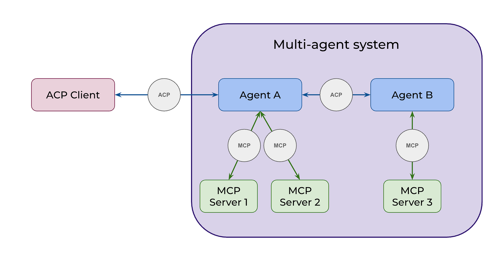
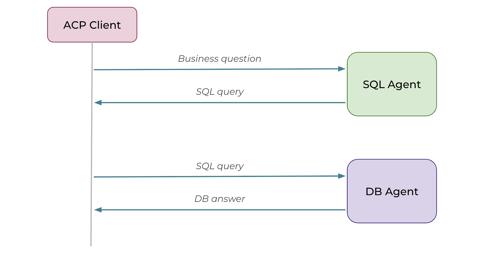
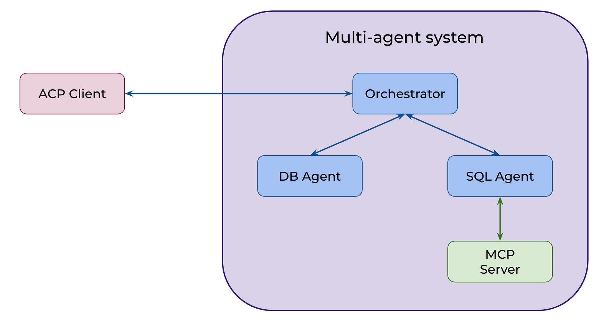

# Будущее коммуникации ИИ-агентов с помощью ACP

*Практическое руководство по объединению и координации нескольких ИИ-агентов*

Мария Мансурова<br />15 июля 2025 г.<br />17 мин. на чтение<br />[Оригинал](https://towardsdatascience.com/the-future-of-ai-agent-communication-with-acp/)

Приятно наблюдать, как индустрия генеративного ИИ (GenAI) начинает двигаться в сторону стандартизации. Возможно, мы являемся свидетелями чего-то похожего на зарю интернета, когда только появился HTTP (HyperText Transfer Protocol — протокол передачи гипертекста). Когда Тим Бернерс-Ли разработал HTTP в 1990 году, он предоставил простой, но расширяемый протокол, который превратил интернет из специализированной исследовательской сети во всемирно доступную Всемирную паутину. К 1993 году веб-браузеры, такие как Mosaic, сделали HTTP настолько популярным, что веб-трафик быстро обогнал другие системы.

Один из многообещающих шагов в этом направлении — MCP (Model Context Protocol — протокол контекста модели), разработанный Anthropic. MCP набирает популярность благодаря попыткам стандартизировать взаимодействие между LLM и внешними инструментами или источниками данных. Совсем недавно ([первый коммит](https://github.com/i-am-bee/acp/commit/19e4c708153e23b529d09cdc6e23f0e95ef8a933) датирован апрелем 2025 года) появился новый протокол под названием ACP (Agent Communication Protocol — протокол связи агентов). Он дополняет MCP, определяя способы взаимодействия агентов друг с другом.



В этой статье я хотела бы обсудить, что такое ACP, почему он может быть полезен и как его можно использовать на практике. Мы создадим мультиагентную систему ИИ для взаимодействия с данными.

## Обзор ACP

Прежде чем перейти к практике, давайте уделим немного времени теории, лежащей в основе ACP, и разберемся, как он работает «под капотом».

ACP (Agent Communication Protocol) — это открытый протокол, предназначенный для решения растущей проблемы объединения ИИ-агентов, приложений и людей. Современная индустрия генеративного ИИ довольно фрагментирована: разные команды изолированно создают агентов, используя различные, часто несовместимые фреймворки и технологии. Эта фрагментация замедляет инновации и затрудняет эффективное взаимодействие агентов.

Чтобы решить эту проблему, ACP нацелен на стандартизацию коммуникации между агентами через REST API. Протокол не зависит от фреймворка и технологий, то есть его можно использовать с любым агентным фреймворком, таким как LangChain, CrewAI, smolagents и другими. Такая гибкость упрощает создание интероперабельных систем, в которых агенты могут беспрепятственно работать вместе, независимо от того, как они были изначально разработаны.

Этот протокол был разработан как открытый стандарт под эгидой Linux Foundation, наряду с BeeAI (его эталонной реализацией). Один из ключевых моментов, который подчеркивает команда, заключается в том, что ACP имеет открытое управление и формируется сообществом, а не группой вендоров.

## Какие преимущества может принести ACP?

* **Легко заменяемые агенты.** 🤖 При текущих темпах инноваций в сфере генеративного ИИ постоянно появляются новые передовые технологии. ACP позволяет бесшовно заменять агентов в рабочей среде (продакшене), снижая затраты на обслуживание и упрощая внедрение самых современных инструментов по мере их появления.

* **Взаимодействие между агентами, созданными на разных фреймворках.** 🤝 Как мы знаем из опыта управления людьми, специализация часто приводит к лучшим результатам. То же самое относится и к агентным системам. Группа агентов, каждый из которых сосредоточен на конкретной задаче (например, написание кода на Python или поиск в интернете), часто может превзойти одного агента, который пытается делать всё сразу. ACP позволяет таким специализированным агентам общаться и работать вместе, даже если они созданы с использованием разных фреймворков или технологий.

* **Новые возможности для партнерства.** 💡 С единым стандартом для коммуникации агентов им будет проще взаимодействовать, что будет стимулировать новые партнерства между различными командами внутри компании или даже между разными компаниями. Представьте себе мир, в котором агент вашего умного дома замечает необычное падение температуры, определяет, что система отопления вышла из строя, и связывается с агентом вашего поставщика коммунальных услуг, чтобы подтвердить отсутствие плановых отключений. Наконец, он вызывает специалиста, координируя визит с вашим агентом Google Календаря, чтобы убедиться, что вы будете дома. Это может звучать футуристично, но с ACP это может стать реальностью довольно скоро.

## ACP на практике

Давайте опробуем ACP на классическом примере — **«диалоге с данными»**. Чтобы воспользоваться преимуществом ACP, а именно его **независимостью от фреймворков**, мы создадим агентов с помощью разных инструментов:

  * **SQL-агент** на базе **CrewAI** для составления SQL-запросов.
  * **DB-агент** на базе **smolagents** от HuggingFace для выполнения этих запросов.

Я не буду здесь вдаваться в детали каждого фреймворка, но если вам интересно, я написала о них подробные статьи:

>  * [«Основы мультиагентных систем ИИ»](https://towardsdatascience.com/multi-ai-agent-systems-101-bac58e3bcc47/) о CrewAI.
>  * [«Кодовые агенты: будущее агентного ИИ»](https://towardsdatascience.com/code-agents-the-future-of-agentic-ai/) о smolagents.


### Создание DB-агента

Начнем с DB-агента. Как я упоминала ранее, ACP может быть дополнен MCP. Поэтому я буду использовать инструменты из своего набора для аналитики через **MCP-сервер**. Реализацию MCP-сервера вы можете найти на [**GitHub**](https://github.com/miptgirl/mcp-analyst-toolkit). Для более глубокого погружения и пошаговых инструкций обратитесь к [**моей предыдущей статье**](https://towardsdatascience.com/your-personal-analytics-toolbox/), где я подробно разбирала MCP.

Сам код довольно прост: мы инициализируем ACP-сервер и используем декоратор ```@server.agent()``` для определения функции нашего агента. Эта функция ожидает на входе список сообщений и возвращает генератор.

```python
from collections.abc import AsyncGenerator
from acp_sdk.models import Message, MessagePart
from acp_sdk.server import Context, RunYield, RunYieldResume, Server
from smolagents import LiteLLMModel,ToolCallingAgent, ToolCollection
import logging 
from dotenv import load_dotenv
from mcp import StdioServerParameters

load_dotenv() 

# initialise ACP server
server = Server()

# initialise LLM
model = LiteLLMModel(
  model_id="openai/gpt-4o-mini",  
  max_tokens=2048
)

# define config for MCP server to connect
server_parameters = StdioServerParameters(
  command="uv",
  args=[
      "--directory",
      "/Users/marie/Documents/github/mcp-analyst-toolkit/src/mcp_server",
      "run",
      "server.py"
  ],
  env=None
)

@server.agent()
async def db_agent(input: list[Message], context: Context) -> AsyncGenerator[RunYield, RunYieldResume]:
  "This is a CodeAgent can execute SQL queries against ClickHouse database."
  with ToolCollection.from_mcp(server_parameters, trust_remote_code=True) as tool_collection:
    agent = ToolCallingAgent(tools=[*tool_collection.tools], model=model)
    question = input[0].parts[0].content
    response = agent.run(question)

  yield Message(parts=[MessagePart(content=str(response))])

if __name__ == "__main__":
  server.run(port=8001)
```

Нам также понадобится настроить окружение Python. Для этого я буду использовать менеджер пакетов `uv`.

```bash
# Инициализируем окружение
uv init --name acp-sql-agent

# Активируем виртуальное окружение
uv venv
source .venv/bin/activate

# Устанавливаем зависимости
uv add acp-sdk "smolagents[litellm]" python-dotenv mcp "smolagents[mcp]" ipykernel
```

Затем мы можем запустить агента с помощью следующей команды.

```bash
uv run db_agent.py
```

Если всё настроено правильно, вы увидите, что сервер запущен на порту 8001. Нам понадобится ACP-клиент, чтобы убедиться, что всё работает как надо. Немного терпения, мы скоро это проверим.

### Создание SQL-агента

Но прежде, давайте создадим SQL-агента, который будет составлять запросы. Для этого мы будем использовать фреймворк CrewAI. Наш агент будет обращаться к базе знаний с вопросами и запросами для генерации ответов. Поэтому мы оснастим его инструментом RAG (Retrieval-Augmented Generation — генерация с дополнением извлечёнными данными).

Сначала мы инициализируем RAG-инструмент и загрузим справочный файл `clickhouse_queries.txt`. Затем мы создадим агента CrewAI, указав его `role` (роль), `goal` (цель) и `backstory` (предысторию). Наконец, мы создадим `task` (задачу) и объединим всё вместе в объект `Crew`.

```python
from crewai import Crew, Task, Agent, LLM
from crewai.tools import BaseTool
from crewai_tools import RagTool
from collections.abc import AsyncGenerator
from acp_sdk.models import Message, MessagePart
from acp_sdk.server import RunYield, RunYieldResume, Server
import json
import os
from datetime import datetime
from typing import Type
from pydantic import BaseModel, Field

import nest_asyncio
nest_asyncio.apply()

# config for RAG tool
config = {
  "llm": {
    "provider": "openai",
    "config": {
      "model": "gpt-4o-mini",
    }
  },
  "embedding_model": {
    "provider": "openai",
    "config": {
      "model": "text-embedding-ada-002"
    }
  }
}

# initialise tool
rag_tool = RagTool(
  config=config,  
  chunk_size=1200,       
  chunk_overlap=200)

rag_tool.add("clickhouse_queries.txt")

# initialise ACP server
server = Server()

# initialise LLM
llm = LLM(model="openai/gpt-4o-mini", max_tokens=2048)

@server.agent()
async def sql_agent(input: list[Message]) -> AsyncGenerator[RunYield, RunYieldResume]:
  "This agent knows the database schema and can return SQL queries to answer questions about the data."

  # create agent
  sql_agent = Agent(
    role="Senior SQL analyst", 
    goal="Write SQL queries to answer questions about the e-commerce analytics database.",
    backstory="""
You are an expert in ClickHouse SQL queries with over 10 years of experience. You are familiar with the e-commerce analytics database schema and can write optimized queries to extract insights.
        
## Database Schema

You are working with an e-commerce analytics database containing the following tables:

### Table: ecommerce.users 
**Description:** Customer information for the online shop
**Primary Key:** user_id
**Fields:** 
- user_id (Int64) - Unique customer identifier (e.g., 1000004, 3000004)
- country (String) - Customer's country of residence (e.g., "Netherlands", "United Kingdom")
- is_active (Int8) - Customer status: 1 = active, 0 = inactive
- age (Int32) - Customer age in full years (e.g., 31, 72)

### Table: ecommerce.sessions 
**Description:** User session data and transaction records
**Primary Key:** session_id
**Foreign Key:** user_id (references ecommerce.users.user_id)
**Fields:** 
- user_id (Int64) - Customer identifier linking to users table (e.g., 1000004, 3000004)
- session_id (Int64) - Unique session identifier (e.g., 106, 1023)
- action_date (Date) - Session start date (e.g., "2021-01-03", "2024-12-02")
- session_duration (Int32) - Session duration in seconds (e.g., 125, 49)
- os (String) - Operating system used (e.g., "Windows", "Android", "iOS", "MacOS")
- browser (String) - Browser used (e.g., "Chrome", "Safari", "Firefox", "Edge")
- is_fraud (Int8) - Fraud indicator: 1 = fraudulent session, 0 = legitimate
- revenue (Float64) - Purchase amount in USD (0.0 for non-purchase sessions, >0 for purchases)

## ClickHouse-Specific Guidelines

1. **Use ClickHouse-optimized functions:**
   - uniqExact() for precise unique counts
   - uniqExactIf() for conditional unique counts
   - quantile() functions for percentiles
   - Date functions: toStartOfMonth(), toStartOfYear(), today()

2. **Query formatting requirements:**
   - Always end queries with "format TabSeparatedWithNames"
   - Use meaningful column aliases
   - Use proper JOIN syntax when combining tables
   - Wrap date literals in quotes (e.g., '2024-01-01')

3. **Performance considerations:**
   - Use appropriate WHERE clauses to filter data
   - Consider using HAVING for post-aggregation filtering
   - Use LIMIT when finding top/bottom results

4. **Data interpretation:**
   - revenue > 0 indicates a purchase session
   - revenue = 0 indicates a browsing session without purchase
   - is_fraud = 1 sessions should typically be excluded from business metrics unless specifically analyzing fraud

## Response Format
Provide only the SQL query as your answer. Include brief reasoning in comments if the query logic is complex. 
        """,

    verbose=True,
    allow_delegation=False,
    llm=llm,
    tools=[rag_tool], 
    max_retry_limit=5
  )
    
  # create task
  task1 = Task(
    description=input[0].parts[0].content,
    expected_output = "Reliable SQL query that answers the question based on the e-commerce analytics database schema.",
    agent=sql_agent
  )

  # create crew
  crew = Crew(agents=[sql_agent], tasks=[task1], verbose=True)
  
  # execute agent
  task_output = await crew.kickoff_async()
  yield Message(parts=[MessagePart(content=str(task_output))])

if __name__ == "__main__":
  server.run(port=8002)
```

Нам также понадобится добавить недостающие пакеты в `uv` перед запуском сервера.

```bash
uv add crewai crewai_tools nest-asyncio
uv run sql_agent.py
```

Теперь второй агент запущен на порту 8002. Когда оба сервера запущены и работают, пришло время проверить, всё ли функционирует правильно.

### Вызов ACP-агента с помощью клиента

Теперь, когда мы готовы протестировать наших агентов, мы будем использовать ACP-клиент для их синхронного запуска. Для этого нам нужно инициализировать `Client`, указав URL сервера, и использовать функцию `run_sync`, передав ей имя агента и входные данные.

```python
import os
import nest_asyncio
nest_asyncio.apply()
from acp_sdk.client import Client
import asyncio

# Set your OpenAI API key here (or use environment variable)
# os.environ["OPENAI_API_KEY"] = "your-api-key-here"

async def example() -> None:
  async with Client(base_url="http://localhost:8001") as client1:
    run1 = await client1.run_sync(
      agent="db_agent", input="select 1 as test"
    )
    print('<TEST> DB agent response:')
    print(run1.output[0].parts[0].content)

  async with Client(base_url="http://localhost:8002") as client2:
    run2 = await client2.run_sync(
      agent="sql_agent", input="How many customers did we have in May 2024?" 
    )
    print('<TEST> SQL agent response:')
    print(run2.output[0].parts[0].content)

if __name__ == "__main__":
  asyncio.run(example())

# <TEST> DB agent response:
# 1
# <TEST> SQL agent response:
# ```
# SELECT COUNT(DISTINCT user_id) AS total_customers
# FROM ecommerce.users
# WHERE is_active = 1
# AND user_id IN (
#     SELECT DISTINCT user_id
#     FROM ecommerce.sessions
#     WHERE action_date >= '2024-05-01' AND action_date < '2024-06-01'
# ) 
# format TabSeparatedWithNames
```

Мы получили ожидаемые результаты от обоих серверов, так что, похоже, всё работает как надо.

> 💡 **Совет**: Вы можете проверить полные логи выполнения в окне терминала, где запущен каждый сервер.

### Объединение агентов в цепочку

Чтобы отвечать на реальные вопросы от клиентов, нам нужно, чтобы оба агента работали вместе. Давайте свяжем их в цепочку один за другим. Итак, мы сначала вызовем SQL-агента, а затем передадим сгенерированный им SQL-запрос DB-агенту для выполнения.



Вот код для объединения агентов в цепочку. Он очень похож на тот, что мы использовали ранее для тестирования каждого сервера по отдельности. Главное отличие в том, что теперь мы передаём результат работы SQL-агента напрямую DB-агенту.

```python
async def example() -> None: 
  async with Client(base_url="http://localhost:8001") as db_agent, Client(base_url="http://localhost:8002") as sql_agent:
    question = 'How many customers did we have in May 2024?'
    sql_query = await sql_agent.run_sync(
      agent="sql_agent", input=question
    )
    print('SQL query generated by SQL agent:')
    print(sql_query.output[0].parts[0].content)
    
    answer = await db_agent.run_sync(
      agent="db_agent", input=sql_query.output[0].parts[0].content
    )
    print('Answer from DB agent:')
    print(answer.output[0].parts[0].content)

asyncio.run(example())
```

Всё прошло гладко, и мы получили ожидаемый результат.

````markdown
SQL query generated by SQL agent:
Thought: I need to craft a SQL query to count the number of unique customers 
who were active in May 2024 based on their sessions.

```sql
SELECT COUNT(DISTINCT u.user_id) AS active_customers
FROM ecommerce.users AS u
JOIN ecommerce.sessions AS s ON u.user_id = s.user_id
WHERE u.is_active = 1
AND s.action_date >= '2024-05-01' 
AND s.action_date < '2024-06-01'
FORMAT TabSeparatedWithNames
```
Answer from DB agent:
234544
````

### Паттерн «Роутер»

В некоторых сценариях использования путь статичен и чётко определён, и мы можем объединять агентов в цепочку напрямую, как мы делали ранее. Однако чаще мы ожидаем, что LLM-агенты будут рассуждать самостоятельно и решать, какие инструменты или агенты использовать для достижения цели.



Для решения таких задач мы реализуем паттерн «Роутер» с помощью ACP. Мы создадим нового агента — **оркестратора** — который сможет делегировать задачи DB- и SQL-агентам.

Начнём с добавления в менеджер пакетов эталонной реализации `beeai_framework`.

```bash
uv add beeai_framework
```

Чтобы наш **оркестратор** мог вызывать SQL- и DB-агентов, мы **«обернём» их в виде инструментов**. Таким образом, оркестратор сможет обращаться с ними как с любыми другими инструментами и вызывать их при необходимости.

Начнём с SQL-агента. Это в основном шаблонный код: мы определяем поля ввода и вывода с помощью **Pydantic**, а затем вызываем агента в функции `_run`.

```python
from pydantic import BaseModel, Field

from acp_sdk import Message
from acp_sdk.client import Client
from acp_sdk.models import MessagePart
from beeai_framework.tools.tool import Tool
from beeai_framework.tools.types import ToolRunOptions
from beeai_framework.context import RunContext
from beeai_framework.emitter import Emitter
from beeai_framework.tools import ToolOutput
from beeai_framework.utils.strings import to_json

# helper function
async def run_agent(agent: str, input: str) -> list[Message]:
  async with Client(base_url="http://localhost:8002") as client:
    run = await client.run_sync(
      agent=agent, input=[Message(parts=[MessagePart(content=input, content_type="text/plain")])]
    )

  return run.output

class SqlQueryToolInput(BaseModel):
  question: str = Field(description="The question to answer using SQL queries against the e-commerce analytics database")

class SqlQueryToolResult(BaseModel):
  sql_query: str = Field(description="The SQL query that answers the question")

class SqlQueryToolOutput(ToolOutput):
  result: SqlQueryToolResult = Field(description="SQL query result")

  def get_text_content(self) -> str:
    return to_json(self.result)

  def is_empty(self) -> bool:
    return self.result.sql_query.strip() == ""

  def __init__(self, result: SqlQueryToolResult) -> None:
    super().__init__()
    self.result = result

class SqlQueryTool(Tool[SqlQueryToolInput, ToolRunOptions, SqlQueryToolOutput]):
  name = "SQL Query Generator"
  description = "Generate SQL queries to answer questions about the e-commerce analytics database"
  input_schema = SqlQueryToolInput

  def _create_emitter(self) -> Emitter:
    return Emitter.root().child(
        namespace=["tool", "sql_query"],
        creator=self,
    )

  async def _run(self, input: SqlQueryToolInput, options: ToolRunOptions | None, context: RunContext) -> SqlQueryToolOutput:
    result = await run_agent("sql_agent", input.question)
    return SqlQueryToolOutput(result=SqlQueryToolResult(sql_query=str(result[0])))
```

Проделаем то же самое с DB-агентом.

```python
from pydantic import BaseModel, Field

from acp_sdk import Message
from acp_sdk.client import Client
from acp_sdk.models import MessagePart
from beeai_framework.tools.tool import Tool
from beeai_framework.tools.types import ToolRunOptions
from beeai_framework.context import RunContext
from beeai_framework.emitter import Emitter
from beeai_framework.tools import ToolOutput
from beeai_framework.utils.strings import to_json

async def run_agent(agent: str, input: str) -> list[Message]:
  async with Client(base_url="http://localhost:8001") as client:
    run = await client.run_sync(
      agent=agent, input=[Message(parts=[MessagePart(content=input, content_type="text/plain")])]
    )

  return run.output

class DatabaseQueryToolInput(BaseModel):
  query: str = Field(description="The SQL query or question to execute against the ClickHouse database")

class DatabaseQueryToolResult(BaseModel):
  result: str = Field(description="The result of the database query execution")

class DatabaseQueryToolOutput(ToolOutput):
  result: DatabaseQueryToolResult = Field(description="Database query execution result")

  def get_text_content(self) -> str:
    return to_json(self.result)

  def is_empty(self) -> bool:
    return self.result.result.strip() == ""

  def __init__(self, result: DatabaseQueryToolResult) -> None:
    super().__init__()
    self.result = result

class DatabaseQueryTool(Tool[DatabaseQueryToolInput, ToolRunOptions, DatabaseQueryToolOutput]):
  name = "Database Query Executor"
  description = "Execute SQL queries and questions against the ClickHouse database"
  input_schema = DatabaseQueryToolInput

  def _create_emitter(self) -> Emitter:
    return Emitter.root().child(
      namespace=["tool", "database_query"],
      creator=self,
    )

  async def _run(self, input: DatabaseQueryToolInput, options: ToolRunOptions | None, context: RunContext) -> DatabaseQueryToolOutput:
    result = await run_agent("db_agent", input.query)
    return DatabaseQueryToolOutput(result=DatabaseQueryToolResult(result=str(result[0])))
```

Теперь давайте соберём главного агента, который будет оркестрировать остальные в качестве инструментов. В качестве оркестратора мы будем использовать реализацию агента ReAct из фреймворка BeeAI. Я также добавила дополнительное логирование в «обёртки»-инструменты для наших DB- и SQL-агентов, чтобы мы могли видеть всю информацию о вызовах.

```python
from collections.abc import AsyncGenerator

from acp_sdk import Message
from acp_sdk.models import MessagePart
from acp_sdk.server import Context, Server
from beeai_framework.backend.chat import ChatModel
from beeai_framework.agents.react import ReActAgent
from beeai_framework.memory import TokenMemory
from beeai_framework.utils.dicts import exclude_none
from sql_tool import SqlQueryTool
from db_tool import DatabaseQueryTool
import os
import logging

# Configure logging
logger = logging.getLogger(__name__)
logger.setLevel(logging.INFO)

# Only add handler if it doesn't already exist
if not logger.handlers:
  handler = logging.StreamHandler()
  handler.setLevel(logging.INFO)
  formatter = logging.Formatter('ORCHESTRATOR - %(levelname)s - %(message)s')
  handler.setFormatter(formatter)
  logger.addHandler(handler)

# Prevent propagation to avoid duplicate messages
logger.propagate = False

# Wrapped our tools with additional logging for tracebility
class LoggingSqlQueryTool(SqlQueryTool):
  async def _run(self, input, options, context):
    logger.info(f"🔍 SQL Tool Request: {input.question}")
    result = await super()._run(input, options, context)
    logger.info(f"📝 SQL Tool Response: {result.result.sql_query}")
    return result

class LoggingDatabaseQueryTool(DatabaseQueryTool):
  async def _run(self, input, options, context):
    logger.info(f"🗄️ Database Tool Request: {input.query}")
    result = await super()._run(input, options, context)
    logger.info(f"📊 Database Tool Response: {result.result.result}...")  
    return result

server = Server()

@server.agent(name="orchestrator")
async def orchestrator(input: list[Message], context: Context) -> AsyncGenerator:
  logger.info(f"🚀 Orchestrator started with input: {input[0].parts[0].content}")
    
  llm = ChatModel.from_name("openai:gpt-4o-mini")

  agent = ReActAgent(
    llm=llm,
    tools=[LoggingSqlQueryTool(), LoggingDatabaseQueryTool()],
    templates={
        "system": lambda template: template.update(
          defaults=exclude_none({
            "instructions": """
                You are an expert data analyst assistant that helps users analyze e-commerce data.
                
                You have access to two tools:
                1. SqlQueryTool - Use this to generate SQL queries from natural language questions about the e-commerce database
                2. DatabaseQueryTool - Use this to execute SQL queries directly against the ClickHouse database
                
                The database contains two main tables:
                - ecommerce.users (customer information)
                - ecommerce.sessions (user sessions and transactions)
                
                When a user asks a question:
                1. First, use SqlQueryTool to generate the appropriate SQL query
                2. Then, use DatabaseQueryTool to execute that query and get the results
                3. Present the results in a clear, understandable format
                
                Always provide context about what the data shows and any insights you can derive.
            """,
            "role": "system"
        })
      )
    }, memory=TokenMemory(llm))

  prompt = (str(input[0]))
  logger.info(f"🤖 Running ReAct agent with prompt: {prompt}")
  
  response = await agent.run(prompt)
  
  logger.info(f"✅ Orchestrator completed. Response length: {len(response.result.text)} characters")
  logger.info(f"📤 Final response: {response.result.text}...")  

  yield Message(parts=[MessagePart(content=response.result.text)])

if __name__ == "__main__":
  server.run(port=8003)
```

Теперь, как и раньше, мы можем запустить агента-оркестратора с помощью ACP-клиента, чтобы увидеть результат.

```python
async def router_example() -> None:
  async with Client(base_url="http://localhost:8003") as orchestrator_client:
    question = 'How many customers did we have in May 2024?'
    response = await orchestrator_client.run_sync(
      agent="orchestrator", input=question
    )
    print('Orchestrator response:')
    
    # Debug: Print the response structure
    print(f"Response type: {type(response)}")
    print(f"Response output length: {len(response.output) if hasattr(response, 'output') else 'No output attribute'}")
    
    if response.output and len(response.output) > 0:
      print(response.output[0].parts[0].content)
    else:
      print("No response received from orchestrator")
      print(f"Full response: {response}")

asyncio.run(router_example())
# In May 2024, we had 234,544 unique active customers.
```

Наша система сработала хорошо, и мы получили ожидаемый результат. Отличная работа!

Давайте посмотрим, как это работало «под капотом», проверив логи сервера-оркестратора. Сначала роутер вызвал SQL-агента в качестве SQL-инструмента. Затем он использовал полученный запрос, чтобы вызвать DB-агента. И наконец, он сформировал итоговый ответ.

```sql
ORCHESTRATOR - INFO - 🚀 Orchestrator started with input: How many customers did we have in May 2024?
ORCHESTRATOR - INFO - 🤖 Running ReAct agent with prompt: How many customers did we have in May 2024?
ORCHESTRATOR - INFO - 🔍 SQL Tool Request: How many customers did we have in May 2024?

ORCHESTRATOR - INFO - 📝 SQL Tool Response: 
SELECT COUNT(uniqExact(u.user_id)) AS active_customers
FROM ecommerce.users AS u
JOIN ecommerce.sessions AS s ON u.user_id = s.user_id
WHERE u.is_active = 1 
  AND s.action_date >= '2024-05-01' 
  AND s.action_date < '2024-06-01'
FORMAT TabSeparatedWithNames

ORCHESTRATOR - INFO - 🗄️ Database Tool Request: 
SELECT COUNT(uniqExact(u.user_id)) AS active_customers
FROM ecommerce.users AS u
JOIN ecommerce.sessions AS s ON u.user_id = s.user_id
WHERE u.is_active = 1 
  AND s.action_date >= '2024-05-01' 
  AND s.action_date < '2024-06-01'
FORMAT TabSeparatedWithNames

ORCHESTRATOR - INFO - 📊 Database Tool Response: 234544...
ORCHESTRATOR - INFO - ✅ Orchestrator completed. Response length: 52 characters
ORCHESTRATOR - INFO - 📤 Final response: In May 2024, we had 234,544 unique active customers....
```

Благодаря дополнительному логированию, которое мы добавили, мы можем отследить все вызовы, сделанные оркестратором.

Полный код вы можете найти на [**GitHub**](https://github.com/miptgirl/acp-kpis-explainer).

## Заключение

В этой статье мы рассмотрели протокол ACP и его возможности. Вот краткое изложение ключевых моментов:

  * **ACP (Agent Communication Protocol)** — это открытый протокол, нацеленный на стандартизацию коммуникации между агентами. Он дополняет **MCP**, который отвечает за взаимодействие между агентами и внешними инструментами и источниками данных.
  * ACP следует **клиент-серверной** архитектуре и использует **REST API**.
  * Протокол **не зависит от технологий и фреймворков**, что позволяет создавать интероперабельные системы и беспрепятственно налаживать новое взаимодействие между агентами.
  * С помощью ACP вы можете реализовывать широкий спектр взаимодействий между агентами: от простого **объединения в цепочку** в чётко определённых рабочих процессах до **паттерна «Роутер»**, где оркестратор может динамически делегировать задачи другим агентам.

> Спасибо за прочтение. Надеюсь, эта статья была для вас полезной. Помните совет Эйнштейна: *«Важно не прекращать задавать вопросы. У любопытства есть свои причины для существования».* Пусть ваше любопытство приведёт вас к вашему следующему великому открытию.

## Источник

Эта статья написана под впечатлением от краткого курса [«ACP: Agent Communication Protocol»](https://www.deeplearning.ai/short-courses/acp-agent-communication-protocol/) от **DeepLearning.AI**.